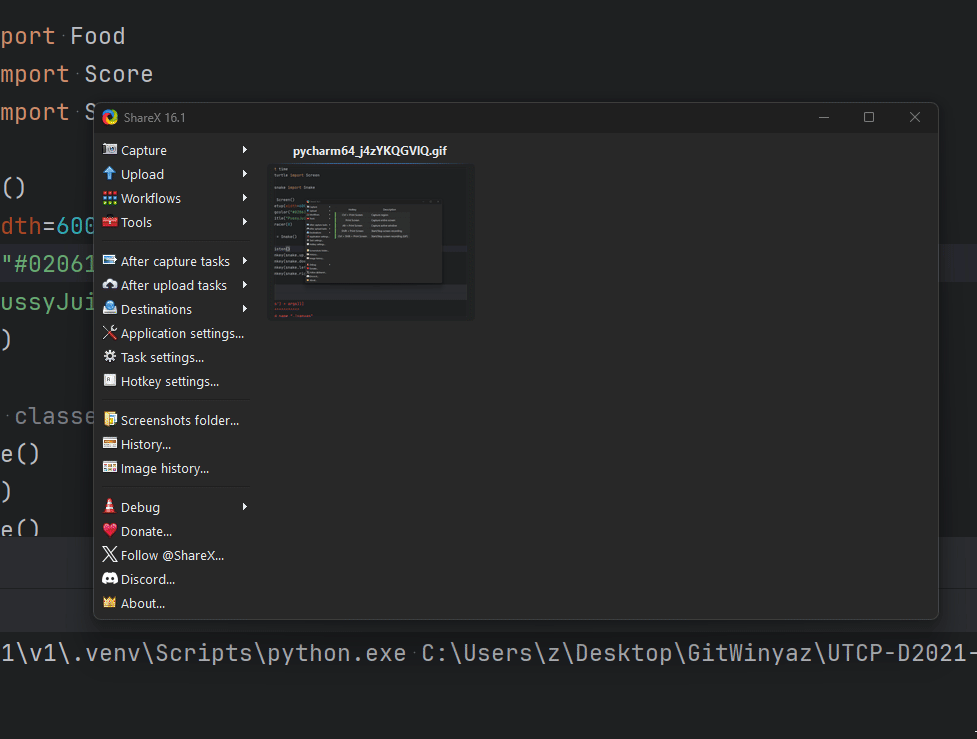

# What ?

> This directory expands on work done in [`snkv2`](../snkv2). \
> It bascially the same but with more features being added. 
> Doing it like this to have original undisturbed code

# Reference

1. From 193 Onwards work all here

# Game

